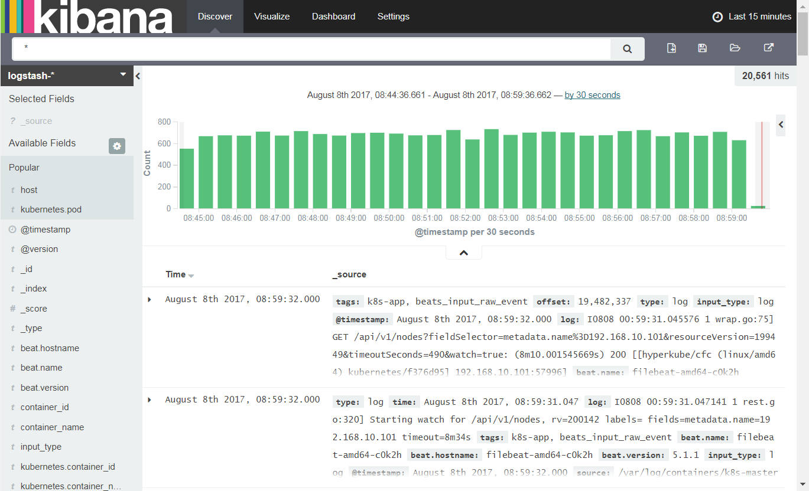

# Kibana for IBM Cloud Private

This is a helm chart for visualizing the built-in elastic in IBM Cloud private v1.2.0. 

## Usage
- Clone the git
- Update the values.yaml elasticsearch.url field with your master node ip. For example
```
elasticsearch:
  url: https://192.168.10.100:8743
``` 
- helm install icp-kibana

## How it works
ICP built in with elastic search engine collecting logs and heapster metrics. The elastic search URL is exposed through to the master node at port 8743 with SSL client cert. verification turned on.

The helm chart use a configMap volume to custom the settings for kibana.yml. It refers a secret volume that utilizing the built-in secret for elastic search.

Note the elastic search in ICP V1.2 is V2.4. The supported latest Kibana version is V4.6

## Sample screen

